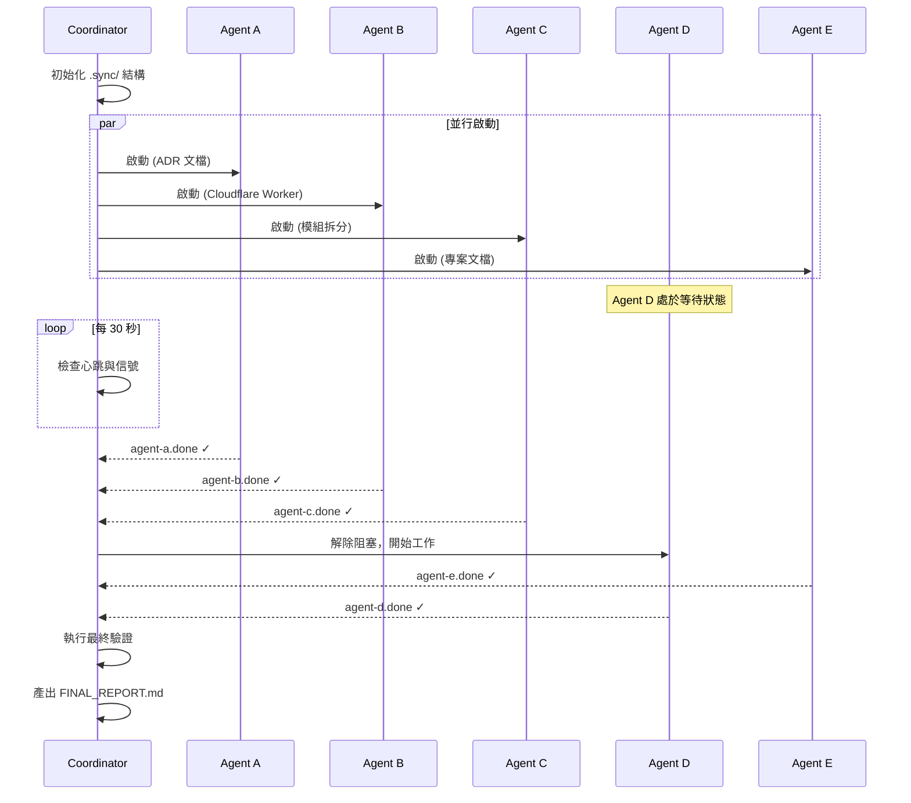

# 🤖 Multi-Agent 協作計劃 V2.0

> **專案**：AI 智能大腦官網改進  
> **設計日期**：2026-01-05  
> **目標**：5 個 Worker Agent + 1 個 Coordinator Agent，可靠並行執行

---

## 🔄 架構改進：從 V1.0 到 V2.0

### V1.0 失敗原因分析

| 問題 | 原因 | 後果 |
|------|------|------|
| Agent C 未執行 | 無監控機制 | 沒人知道任務失敗 |
| Agent D 死鎖 | 無限等待 `.sync/modules-done` | 永遠卡住 |
| 無失敗回報 | 只有成功信號，無錯誤信號 | 無法偵測異常 |
| 無總協調者 | 各 Agent 各自為政 | 無法統籌全局 |

### V2.0 改進策略

```
┌─────────────────────────────────────────────────────────────────┐
│                    Coordinator Agent (協調者)                     │
│  ┌─────────────────────────────────────────────────────────┐    │
│  │  職責：                                                  │    │
│  │  1. 初始化 .sync/ 資料夾                                 │    │
│  │  2. 啟動所有 Worker Agents                               │    │
│  │  3. 輪詢監控心跳與信號                                    │    │
│  │  4. 處理超時與失敗                                       │    │
│  │  5. 最終驗證與報告                                       │    │
│  └─────────────────────────────────────────────────────────┘    │
└─────────────────────────────────────────────────────────────────┘
                               │
           ┌───────────────────┼───────────────────┐
           │                   │                   │
           ▼                   ▼                   ▼
    ┌─────────────┐     ┌─────────────┐     ┌─────────────┐
    │  Agent A    │     │  Agent B    │     │  Agent E    │
    │  ADR 文檔   │     │  CF Worker  │     │  專案文檔   │
    │  (獨立)     │     │  (獨立)     │     │  (最後執行) │
    └─────────────┘     └─────────────┘     └─────────────┘
    
           ┌─────────────────────────────────┐
           │         依賴鏈 (Sequential)      │
           │                                  │
           │  Agent C ──────▶ Agent D         │
           │  模組拆分        測試框架         │
           │                                  │
           └─────────────────────────────────┘
```

---

## 📁 同步機制 V2.0

### 資料夾結構

```
.sync/
├── heartbeat/              # 心跳目錄
│   ├── agent-a.hb          # Agent A 心跳 (每 30 秒更新)
│   ├── agent-b.hb
│   ├── agent-c.hb
│   ├── agent-d.hb
│   └── agent-e.hb
│
├── status/                 # 狀態信號目錄
│   ├── agent-a.done        # 成功完成
│   ├── agent-a.failed      # 失敗 (含錯誤訊息)
│   ├── agent-b.done
│   ├── agent-c.done        # Agent D 等待此信號
│   └── ...
│
├── locks/                  # 檔案鎖定 (防止同時修改)
│   └── chatbot.js.lock     # 當有 Agent 正在修改時
│
└── manifest.json           # 任務清單與狀態摘要
```

### manifest.json 格式

```json
{
  "version": "2.0",
  "createdAt": "2026-01-05T19:50:00+08:00",
  "coordinator": "active",
  "agents": {
    "A": { "status": "pending", "task": "ADR 文檔", "timeout": 180 },
    "B": { "status": "pending", "task": "Cloudflare Worker", "timeout": 300 },
    "C": { "status": "pending", "task": "模組拆分", "timeout": 480 },
    "D": { "status": "waiting", "task": "測試框架", "waitFor": "C", "timeout": 300 },
    "E": { "status": "pending", "task": "專案文檔", "timeout": 180 }
  },
  "globalTimeout": 600
}
```

---

## 🎯 Agent 任務分配 V2.0

### 🌐 Coordinator Agent (協調者)

```markdown
# Coordinator Agent Prompt

你是 Multi-Agent 系統的總協調者。

## Phase 1: 初始化 (Initialization)

1. 建立 `.sync/` 資料夾結構：
   ```
   .sync/heartbeat/
   .sync/status/
   .sync/locks/
   .sync/manifest.json
   ```

2. 寫入 manifest.json 初始狀態

## Phase 2: 啟動 Worker Agents

依序啟動 5 個 Worker Agents（使用 @mention 或平行對話）：
- Agent A, B, C, E: 立即啟動
- Agent D: 在 manifest.json 中標記為 "waiting"

## Phase 3: 監控迴圈 (每 30 秒執行一次)

```
while (未全部完成 AND 未超時):
    1. 檢查 .sync/heartbeat/ 下所有 .hb 檔案
       - 若任一 Agent 心跳超過 60 秒未更新 → 標記為 "stale"
       
    2. 檢查 .sync/status/ 下的信號檔案
       - 若發現 .done → 更新 manifest.json
       - 若發現 .failed → 記錄錯誤，決定是否重試或終止
       
    3. 檢查依賴解鎖
       - 若 agent-c.done 存在 → 通知 Agent D 可以開始
       
    4. 檢查全局超時
       - 若超過 600 秒 → 強制終止並產出報告
```

## Phase 4: 最終驗證

所有 Agent 完成後：
1. 執行整合測試（Browser Subagent）
2. 產出最終報告到 `.sync/FINAL_REPORT.md`
3. 更新 HANDOVER_NOTES.md

## 失敗處理策略

| 情境 | 動作 |
|------|------|
| Agent 心跳停止 | 等待 60 秒，若無恢復則標記失敗 |
| Agent 報告失敗 | 記錄錯誤，嘗試重啟 1 次 |
| 依賴 Agent 失敗 | 取消下游 Agent，產出部分報告 |
| 全局超時 | 終止所有 Agent，產出中斷報告 |
```

---

### 📋 Agent A: ADR 文檔專家

```markdown
你是 ADR（架構決策紀錄）文檔專家。

## 心跳機制
每 30 秒更新一次 `.sync/heartbeat/agent-a.hb`：
```
{"timestamp": "2026-01-05T19:51:00+08:00", "status": "working", "progress": "50%"}
```

## 任務
在 `C:\Users\user\.gemini\antigravity\scratch\ai-brain-website\adr\` 確認/更新 3 個 ADR 文檔：

### 檢查現有檔案
先檢查 adr/ 資料夾是否已有檔案，若有則驗證內容完整性。

### 需要的 ADR：
1. ADR-001-gemini-api.md
2. ADR-002-warm-orange-theme.md  
3. ADR-003-modular-css.md

## 完成通知
成功：建立 `.sync/status/agent-a.done`
```
{"completedAt": "...", "files": ["adr/ADR-001-gemini-api.md", ...]}
```

失敗：建立 `.sync/status/agent-a.failed`
```
{"failedAt": "...", "error": "錯誤描述", "attemptedFiles": [...]}
```

## 超時
若 180 秒內無法完成，寫入 failed 信號並結束。
```

---

### ⚡ Agent B: Cloudflare Worker API 代理專家

```markdown
你是 Cloudflare Worker 專家。

## 心跳機制
每 30 秒更新 `.sync/heartbeat/agent-b.hb`

## 任務
在 `cloudflare-worker/` 確認/更新以下檔案：

1. worker.js - Gemini API 代理
2. wrangler.toml - Cloudflare 設定
3. README.md - 部署說明
4. FRONTEND_INTEGRATION.md - 前端整合指南

## 檢查現有檔案
先檢查資料夾是否已有檔案，若有則驗證功能完整性。

## 完成通知
成功：`.sync/status/agent-b.done`
失敗：`.sync/status/agent-b.failed`

## 超時
300 秒
```

---

### 🔧 Agent C: 模組拆分專家 (關鍵路徑)

```markdown
你是 JavaScript 模組化專家。

## ⚠️ 重要：你是 Agent D 的阻塞者
Agent D 正在等待你的完成信號，請確保任務完成或失敗都要發送信號。

## 心跳機制
每 30 秒更新 `.sync/heartbeat/agent-c.hb`

## 檔案鎖定
開始修改前：建立 `.sync/locks/chatbot.js.lock`
完成後：刪除鎖定檔案

## 任務
將 `chatbot.js` (255 行) 拆分為 3 個模組：

### 1. chatbot-core.js (~80 行)
- GEMINI_API_KEY（使用環境變數佔位符）
- sendToGemini() - 加入 10 秒超時 + 3 次重試
- conversationHistory

### 2. chatbot-ui.js (~70 行)
- initChatbot()
- addMessage() / removeMessage()
- formatMessage()

### 3. chatbot-hints.js (~50 行)
- initHintRotation()
- 輪播邏輯

## 額外工作
1. 備份原始檔案為 `chatbot.js.backup`
2. 更新 `index.html` 引入順序

## 完成通知
成功：`.sync/status/agent-c.done`
```json
{
  "completedAt": "...",
  "files": ["chatbot-core.js", "chatbot-ui.js", "chatbot-hints.js"],
  "linesPerFile": {"core": 78, "ui": 65, "hints": 48},
  "indexHtmlUpdated": true
}
```

失敗：`.sync/status/agent-c.failed`（必須發送，否則 Agent D 會死鎖）

## 超時
480 秒（8 分鐘）
```

---

### 🧪 Agent D: 測試框架專家 (依賴 Agent C)

```markdown
你是前端測試專家。

## 前置等待（有熔斷保護）

```
maxWaitTime = 300 秒
startTime = now()

while (!exists(".sync/status/agent-c.done") AND !exists(".sync/status/agent-c.failed")):
    if (now() - startTime > maxWaitTime):
        # 熔斷：等待超時
        write(".sync/status/agent-d.failed", {
            "error": "等待 Agent C 超時",
            "waitedSeconds": maxWaitTime
        })
        exit()
    
    # 更新心跳表示仍在等待
    write(".sync/heartbeat/agent-d.hb", {
        "status": "waiting",
        "waitingFor": "agent-c"
    })
    
    sleep(5 秒)

# 檢查 Agent C 是否失敗
if exists(".sync/status/agent-c.failed"):
    write(".sync/status/agent-d.failed", {
        "error": "依賴的 Agent C 失敗，無法繼續"
    })
    exit()
```

## 心跳機制
每 30 秒更新 `.sync/heartbeat/agent-d.hb`

## 任務（Agent C 完成後執行）
在 `tests/` 建立測試框架：

1. package.json（添加 jest）
2. jest.config.js
3. chatbot-core.test.js
4. chatbot-ui.test.js
5. chatbot-hints.test.js

## 完成通知
成功：`.sync/status/agent-d.done`
失敗：`.sync/status/agent-d.failed`

## 超時
等待時間 + 工作時間 合計 600 秒
```

---

### 📝 Agent E: 專案文檔專家

```markdown
你是技術文檔專家。

## 心跳機制
每 30 秒更新 `.sync/heartbeat/agent-e.hb`

## 任務
更新專案文檔以反映最新狀態：

### 1. PROJECT_MAP.md
- 更新目錄結構
- 記錄新增的 adr/ 和 cloudflare-worker/
- 若模組拆分完成，更新 JS 檔案清單

### 2. README.md
- 新增快速開始指南
- 新增部署說明連結

### 3. HANDOVER_NOTES.md
- 記錄本次改進摘要
- 更新待處理問題狀態

## 智慧等待（非強制）
可選擇性讀取其他 Agent 的完成信號，以產出更準確的文檔。
但即使其他 Agent 未完成，也應產出「當下狀態」的文檔。

## 完成通知
成功：`.sync/status/agent-e.done`
失敗：`.sync/status/agent-e.failed`

## 超時
180 秒
```

---

## ⏱️ 執行時序圖



---

## 🚀 啟動指令

執行以下步驟來啟動 Multi-Agent 系統：

### Step 1: 請用戶開啟 6 個對話
1. **Coordinator** - 總協調者（本對話可以擔任）
2. **@Agent-A** - ADR 文檔
3. **@Agent-B** - Cloudflare Worker
4. **@Agent-C** - 模組拆分
5. **@Agent-D** - 測試框架
6. **@Agent-E** - 專案文檔

### Step 2: Coordinator 初始化 .sync/ 資料夾

### Step 3: 複製對應的 Prompt 到各對話啟動

---

## ✅ 成功標準

- [ ] `.sync/status/agent-a.done` 存在
- [ ] `.sync/status/agent-b.done` 存在
- [ ] `.sync/status/agent-c.done` 存在
- [ ] `.sync/status/agent-d.done` 存在
- [ ] `.sync/status/agent-e.done` 存在
- [ ] 無任何 `.failed` 檔案
- [ ] `chatbot.js` 已拆分為 3 個檔案
- [ ] 每個 JS 檔案 < 200 行
- [ ] `tests/` 資料夾包含測試檔案

---

*V2.0 設計時間：2026-01-05 19:51*
