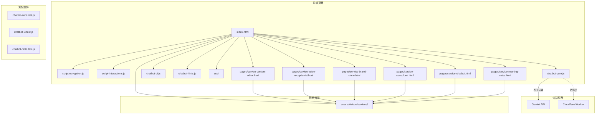

# 🗺️ PROJECT_MAP.md - AI 智能大腦官網專案地圖

> **專案類型**：企業形象官網 + AI 客服系統  
> **技術棧**：純靜態 HTML/CSS/JS + Gemini API + Veo 3.1 API  
> **當前狀態**：🟢 開發完成 - 運行中

---

## 🎯 核心願景

展示 AI 智能大腦公司的六大核心服務，並透過 AI 聊天客服即時回答訪客問題。每個服務都有獨立的詳情頁面，配有 AI 生成的背景影片。

---

## 🏗️ 架構拓撲



---

## 📁 目錄結構

```
ai-brain-website/
├── index.html                      # 主頁面
├── pages/                          # 🆕 服務詳情頁面
│   ├── service-content-editor.html     # 自動流量小編
│   ├── service-voice-receptionist.html # 智慧接線生
│   ├── service-brand-clone.html        # 品牌分身
│   ├── service-consultant.html         # AI 顧問
│   ├── service-chatbot.html            # 智慧財務長 (CFO)
│   └── service-meeting-notes.html      # 情報腦
│
├── script-navigation.js            # 導覽列邏輯 (~100 行)
├── script-interactions.js          # 互動效果 (~110 行)
├── chatbot-core.js                 # API 通訊與對話管理 (~130 行)
├── chatbot-ui.js                   # 聊天視窗 UI (~170 行)
├── chatbot-hints.js                # 提示輪播控制 (~175 行)
│
├── css/
│   ├── variables.css               # CSS 變數
│   ├── base.css                    # 基礎樣式
│   ├── layout.css                  # 佈局
│   ├── components.css              # 元件
│   ├── sections-hero.css           # Hero 區塊
│   ├── sections-services.css       # 服務區塊 (含 AI 智囊團特色樣式)
│   ├── solutions-video-showcase.css # 🆕 影片展示區塊
│   ├── service-page.css            # 服務詳情頁專用
│   ├── service-fullscreen-layout.css
│   ├── service-fullscreen-content.css
│   ├── digital-workforce-layout.css
│   ├── digital-workforce-cards.css
│   ├── chatbot/                    # 聊天客服樣式 (已拆分)
│   │   ├── chatbot-toggle.css
│   │   ├── chatbot-window.css
│   │   └── chatbot-messages.css
│   └── animations.css              # 動畫
│
├── assets/
│   ├── videos/
│   │   ├── hero.mp4                # 首頁 Hero 影片
│   │   └── services/               # 🆕 Veo 3.1 服務影片
│   │       ├── service_content_editor.mp4
│   │       ├── service_voice_receptionist.mp4
│   │       ├── service_brand_clone.mp4
│   │       ├── service_consultant.mp4
│   │       ├── service_chatbot.mp4
│   │       └── service_meeting_notes.mp4
│   └── images/
│
├── scripts/                        # 🆕 工具腳本
│   └── generate_service_videos.py  # Veo 3.1 影片生成腳本
│
├── cloudflare-worker/              # API 代理
│   ├── worker.js
│   ├── wrangler.toml
│   └── README.md
│
├── tests/                          # 測試套件
│   ├── package.json               
│   ├── chatbot-core.test.js
│   ├── chatbot-ui.test.js
│   └── chatbot-hints.test.js
│
├── adr/                            # 架構決策紀錄
│   ├── ADR-001-gemini-api.md
│   ├── ADR-002-warm-orange-theme.md
│   ├── ADR-003-modular-css.md
│   ├── ADR-004-chatbot-module-split.md
│   ├── ADR-005-cloudflare-worker-proxy.md
│   └── ADR-006-200-line-principle.md
│
├── _archive/                       # 廢棄檔案存檔
│
├── ARCHITECTURE.md                 # 專案憲法
├── PROJECT_MAP.md                  # 專案地圖 (本文件)
├── TASKS.md                        # 任務追蹤
├── HANDOVER_NOTES.md               # 交接紀錄
├── GEMINI.md                       # Gemini API 文檔
└── README.md                       # 快速入門
```

---

## 📊 模組狀態

| 模組 | 狀態 | 說明 |
|------|------|------|
| Hero Section | 🟢 Stable | 影片背景 + 文案 |
| 導覽列 | 🟢 Stable | 滾動變色 + 響應式 |
| 五大 AI 解決方案 | 🟢 **UPDATED** | 影片展示 + 5 卡片 (含 AI 智囊團) |
| 服務詳情頁 | 🟢 Stable | 6 個獨立頁面 + 影片背景 |
| 解決方案 | 🟢 Stable | 成功案例展示 |
| 聯繫表單 | 🟢 Stable | 表單 UI |
| AI 聊天客服 | 🟢 Stable | 已拆分為 3 個模組 |
| Veo 影片 | 🟢 **NEW** | 首頁展示 + 6 服務影片 |
| 測試框架 | 🟢 Ready | 40 個測試案例 |

---

## 📹 Veo 3.1 影片資源

| 服務 | 影片檔案 | 大小 | 時長 |
|------|----------|------|------|
| 自動流量小編 | `service_content_editor.mp4` | 2.57 MB | 8 秒 |
| 智慧接線生 | `service_voice_receptionist.mp4` | 1.81 MB | 8 秒 |
| 品牌分身 | `service_brand_clone.mp4` | 2.46 MB | 8 秒 |
| AI 顧問 | `service_consultant.mp4` | 2.49 MB | 8 秒 |
| 智慧財務長 | `service_chatbot.mp4` | 2.53 MB | 8 秒 |
| 情報腦 | `service_meeting_notes.mp4` | 2.62 MB | 8 秒 |

---

## ✅ 技術債狀態

### 已解決 (2026-01-05 ~ 2026-01-06)

| 問題 | 解決日期 |
|------|----------|
| ~~API Key 暴露~~ | 2026-01-05 (使用 Worker 代理) |
| ~~chatbot.js 超過 200 行~~ | 2026-01-05 (已拆分為 3 模組) |
| ~~CSS 檔案超標~~ | 2026-01-05 (已拆分) |
| ~~無測試覆蓋~~ | 2026-01-05 (40 個測試案例) |
| ~~缺少 ADR~~ | 2026-01-05 (6 份 ADR) |
| ~~缺少服務詳情頁~~ | 2026-01-06 (6 個頁面) |
| ~~缺少服務影片~~ | 2026-01-06 (Veo 3.1 生成) |

### 待改進 (P2)

| 問題 | 狀態 |
|------|------|
| WCAG 對比度審計 | ⏳ 待處理 |
| 影片懶加載 | ⏳ 待處理 |
| API 超時/重試機制 | ⏳ 待處理 |

---

## 🔧 開發指令

```bash
# 啟動本地伺服器
cd C:\Users\user\.gemini\antigravity\scratch\ai-brain-website
python -m http.server 8080

# 訪問網站
http://localhost:8080

# 執行測試
cd tests
npm install
npm test
npm run test:coverage

# 生成 Veo 影片 (需要 API Key)
cd scripts
python generate_service_videos.py
```

---

*最後更新：2026-01-06 11:58*
