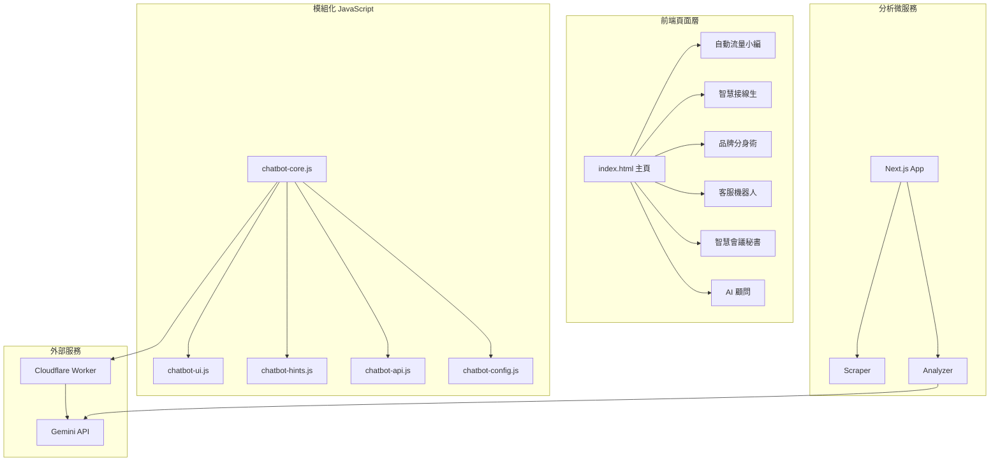

# 📋 AI 智能大腦公司官網 - 專案技術報告

> **報告版本**: v1.0.0  
> **報告日期**: 2026-01-07  
> **專案狀態**: 🟢 Production Ready (上線運行中)  
> **Live URL**: [https://ai-brain-website.vercel.app](https://ai-brain-website.vercel.app)

---

## 一、專案概覽

### 1.1 專案定位

| 項目 | 內容 |
|------|------|
| **專案名稱** | AI 智能大腦公司官網 |
| **專案類型** | 企業形象官網 + AI 客服系統 + 網站分析微服務 |
| **目標客群** | B2B 企業決策者、中小企業主 (5-50 人規模) |
| **核心價值** | 協助企業透過 AI 導入降低營運成本、提升服務效率 |

### 1.2 專案規模統計

| 指標 | 主站 AI Brain | 分析微服務 | **總計** |
|------|--------------|-----------|----------|
| 原始碼檔案 | ~115 個 | ~18 個 | **~133 個** |
| HTML/TSX 頁面 | 9 個 | 5 個 | **14 個** |
| CSS 模組 | 59 個 | 1 個 | **60 個** |
| JS/TS 模組 | 24 個 | 9 個 | **33 個** |
| 測試檔案 | 3 個 | 2 個 | **5 個** |
| ADR 文檔 | 6 個 | 0 個 | **6 個** |
| 靜態資產 | ~58 MB | - | **~58 MB** |

---

## 二、技術架構

### 2.1 技術棧

#### 主站 (ai-brain-website)
```
┌─────────────────────────────────────────────────────────────┐
│  Frontend: 純靜態 HTML5 / CSS3 / Vanilla JavaScript         │
│  AI Engine: Google Gemini 2.0 Flash API                     │
│  Video: Google Veo 3.1 API (8秒高清服務影片)                  │
│  API Proxy: Cloudflare Workers (安全代理)                    │
│  Hosting: Vercel (全球 CDN)                                  │
│  Testing: Jest (52+ 測試案例，80%+ 覆蓋率)                   │
└─────────────────────────────────────────────────────────────┘
```

#### 分析微服務 (ai-website-analyzer)
```
┌─────────────────────────────────────────────────────────────┐
│  Framework: Next.js 15 (App Router)                         │
│  Language: TypeScript                                        │
│  AI Engine: Google Gemini 2.0 Flash                         │
│  Styling: Tailwind CSS                                       │
│  Hosting: Vercel Serverless Functions                        │
└─────────────────────────────────────────────────────────────┘
```

### 2.2 架構拓撲圖



---

## 三、視覺設計系統

### 3.1 設計哲學

本專案採用 **Hermès 愛馬仕風格** 的高端視覺設計，強調：
- 奢華感與專業度的平衡
- 符合 WCAG / APCA 無障礙標準
- 8px Grid 系統確保視覺一致性

### 3.2 配色系統

#### 主色調 - Hermès 暖橘
```css
--color-primary: #D2691E;       /* 主橘色 */
--color-primary-light: #E07B3A; /* 淺橘 (hover) */
--color-primary-dark: #B85A15;  /* 深橘 (active) */
```

#### 輔助色 - 古銅金
```css
--color-accent: #CD853F;        /* 古銅金 */
--color-accent-light: #DDA15E;  /* 淺金 */
--color-accent-dark: #A0522D;   /* 深金 */
```

#### AI 科技感 - 深鈦灰
```css
--tech-titanium: #2D3436;  /* 權威感 */
--tech-midnight: #1A1E23;  /* 深度感 */
--tech-slate: #4A5568;     /* 石板灰 */
```

### 3.3 APCA 對比度合規

所有文字元素均符合 APCA (Advanced Perceptual Contrast Algorithm) 標準：

| 元素類型 | 對比度目標 | 實際達成 |
|----------|-----------|---------|
| 主要正文 | Lc 75+ | ✅ 達成 |
| 大標題 (>24px) | Lc 60+ | ✅ 達成 |
| UI 元件文字 | Lc 45+ | ✅ 達成 |

```css
/* APCA 合規色彩 */
--color-primary-accessible: #9A4A10;  /* 深橘 - 確保白色文字對比度 */
--text-primary: #1A0F0A;              /* 極深棕 - 主標題 */
--text-secondary: #2D1810;            /* 深棕 - 正文 */
```

### 3.4 字體系統

採用 Google Fonts **Noto Sans TC** 字體家族，搭配 1.250x Major Third 比例尺：

```css
--font-size-base: 1.25rem;  /* 20px - 加大基礎字體 */
--font-size-lg: 1.5rem;     /* 24px */
--font-size-xl: 1.75rem;    /* 28px */
--font-size-2xl: 2.25rem;   /* 36px */
--font-size-3xl: 3rem;      /* 48px */
--font-size-4xl: 4rem;      /* 64px */
--font-size-5xl: 5rem;      /* 80px */
```

### 3.5 間距系統 (8px Grid)

```css
--spacing-xs: 4px;
--spacing-sm: 8px;
--spacing-md: 16px;
--spacing-lg: 24px;
--spacing-xl: 32px;
--spacing-2xl: 48px;
--spacing-3xl: 64px;
--spacing-4xl: 80px;
--spacing-5xl: 120px;  /* 超大呼吸感間距 */
```

### 3.6 3D 品牌標識 - Saturn Orbital

專案採用純 CSS 3D 技術打造的 **土星軌道 (Saturn Orbital)** Logo：

```
特色：
├── 3D 旋轉球體 (土星本體)
├── 動態星環 (傾斜軌道)
├── 雙衛星軌道動畫
└── 發光效果 (Glow)
```

---

## 四、功能模組詳情

### 4.1 核心服務頁面 (6 個)

| 服務名稱 | 頁面路徑 | 定價 | 核心價值 |
|---------|---------|------|----------|
| **自動流量小編** | `/pages/service-content-editor.html` | NT$18,800/月 | 相當於 1 位月薪 3-5 萬的內容小編 |
| **智慧接線生** | `/pages/service-voice-receptionist.html` | NT$28,800/月 | 24hr 全年無休電話客服 |
| **品牌分身術** | `/pages/service-brand-clone.html` | NT$12,800/月 | 每月省 15+ 小時社群經營時間 |
| **客服機器人** | `/pages/service-chatbot.html` | NT$8,800/月 | 減少 80% 重複問答 |
| **智慧會議秘書** | `/pages/service-meeting-notes.html` | NT$4,800/月 | 每場會議省 30 分鐘記錄時間 |
| **AI 顧問** | `/pages/service-consultant.html` | NT$88,000/專案 | 降低 AI 導入失敗風險 |

### 4.2 AI 聊天客服系統

模組化架構，嚴格遵守 200 行原則：

```
chatbot/
├── chatbot-core.js    (~130 行) - API 通訊與對話管理
├── chatbot-ui.js      (~170 行) - 聊天視窗 UI
├── chatbot-hints.js   (~175 行) - 提示輪播控制
├── chatbot-api.js     (~100 行) - API 封裝
└── chatbot-config.js  (~100 行) - 配置項
```

**技術亮點**：
- 使用 `crypto.randomUUID()` 避免 Message ID 碰撞
- Cloudflare Worker 代理保護 API Key
- 支援 Gemini 2.0 Flash 即時對話

### 4.3 AI 網站分析器

整合於首頁的 Lead Magnet 功能：

```
功能流程：
1. 用戶輸入網站 URL
2. 後端爬蟲抓取目標網站
3. Gemini AI 進行 6 維度分析
4. 生成專業 PDF 報告
5. 觸發諮詢轉換
```

**六大分析維度**：
- 語音服務機會
- 數據分析潛力
- 流程自動化空間
- 內容智能生成
- 會議效率提升
- 戰略顧問需求

### 4.4 n8n 工作流程視覺引擎

首頁 Hero 區塊展示的互動式工作流程模擬器：

```
css/n8n-workflow/
├── _index.css           - 入口索引
├── variables.css        - 工作流變數
├── base-reset.css       - 基礎重置
├── canvas.css           - 畫布樣式
├── nodes.css            - 節點樣式
├── connections.css      - 連線動畫
├── bubbles.css          - 數據氣泡
├── result-preview.css   - 結果預覽
├── status-bar.css       - 狀態列
└── responsive.css       - 響應式適配
```

### 4.5 AI 成熟度測驗

互動式問卷系統，幫助訪客評估 AI 導入 readiness：

- 5 個精選問題
- 即時結果計算
- 個人化服務推薦
- 約 1 分鐘完成

---

## 五、多媒體資產

### 5.1 Veo 3.1 服務影片

使用 Google Veo 3.1 API 生成的專業服務展示影片：

| 服務 | 檔案名稱 | 大小 | 時長 |
|------|----------|------|------|
| 自動流量小編 | `service_content_editor.mp4` | 2.57 MB | 8 秒 |
| 智慧接線生 | `service_voice_receptionist.mp4` | 1.81 MB | 8 秒 |
| 品牌分身術 | `service_brand_clone.mp4` | 2.46 MB | 8 秒 |
| AI 顧問 | `service_consultant.mp4` | 2.49 MB | 8 秒 |
| 客服機器人 | `service_chatbot.mp4` | 2.53 MB | 8 秒 |
| 智慧會議秘書 | `service_meeting_notes.mp4` | 2.62 MB | 8 秒 |

### 5.2 專業攝影素材

32 張 AI 生成的高清企業形象素材：

**人物攝影 (Human-Centric)**：
- 25-32 歲台灣專業團隊形象
- 心理色彩映射 (Psychological Color Mapping)
- Z-Pattern 視覺動線

**技術視覺 (Tech Visuals)**：
- AI 引擎示意圖
- 後端架構視覺化
- 部署流程圖解

---

## 六、模組化 CSS 架構

### 6.1 目錄結構

```
css/
├── variables.css              # 全局變數 (196 行)
├── base.css                   # 基礎樣式
├── layout.css                 # 佈局系統
├── components.css             # 通用元件
│
├── chatbot/                   # 聊天客服 (3 檔案)
│   ├── chatbot-toggle.css
│   ├── chatbot-window.css
│   └── chatbot-messages.css
│
├── n8n-workflow/              # 工作流引擎 (12 檔案)
│   ├── _index.css
│   ├── variables.css
│   ├── nodes.css
│   ├── connections.css
│   └── ...
│
├── p1-marketing/              # 行銷模組 (14 檔案)
│   ├── _index.css
│   ├── workflow-layers.css
│   ├── industries.css
│   ├── guarantee.css
│   ├── voice-collection.css
│   ├── human-ai-boundary.css
│   ├── output-preview.css
│   ├── content-nurture.css
│   ├── scarcity.css
│   ├── maturity-quiz.css
│   ├── responsive.css
│   ├── not-for-section.css
│   ├── origin-story.css
│   └── real-scenario.css
│
└── sections-*.css             # 區塊樣式
```

### 6.2 200 行熔斷原則

所有代碼檔案嚴格遵守：

| 行數範圍 | 狀態 | 動作 |
|----------|------|------|
| < 150 行 | 🟢 健康 | 繼續開發 |
| 150-200 行 | 🟡 警告 | 考慮拆分 |
| > 200 行 | 🔴 熔斷 | 強制拆分 |

---

## 七、測試與品質保證

### 7.1 測試覆蓋

```
tests/
├── chatbot-core.test.js   (52 測試案例)
├── chatbot-ui.test.js
└── chatbot-hints.test.js
```

**覆蓋率目標**：≥ 80%

### 7.2 架構決策紀錄 (ADR)

| ADR 編號 | 決策主題 |
|----------|----------|
| ADR-001 | Gemini API 整合策略 |
| ADR-002 | Hermès 暖橘主題色選擇 |
| ADR-003 | 模組化 CSS 架構設計 |
| ADR-004 | Chatbot 模組拆分方案 |
| ADR-005 | Cloudflare Worker API 代理 |
| ADR-006 | 200 行熔斷原則制定 |

---

## 八、安全機制

### 8.1 API Key 保護

```
❌ 禁止：前端硬編碼 API Key
✅ 正確：Cloudflare Worker 代理

架構：
Frontend → Cloudflare Worker → Gemini API
             ↑
       (API Key 存放於 Worker 環境變數)
```

### 8.2 資料安全

- 企業級資料加密
- 無敏感資訊存儲
- HTTPS 全站強制

---

## 九、部署與運維

### 9.1 部署架構

```
┌─────────────────────────────────────────────────────────────┐
│                     Vercel Edge Network                      │
├─────────────────────────────────────────────────────────────┤
│  ┌─────────────┐    ┌─────────────┐    ┌─────────────┐     │
│  │  ai-brain   │    │ ai-analyzer │    │ Cloudflare  │     │
│  │   website   │    │  Next.js    │    │   Worker    │     │
│  └─────────────┘    └─────────────┘    └─────────────┘     │
└─────────────────────────────────────────────────────────────┘
```

### 9.2 開發指令

```bash
# 啟動本地伺服器
cd C:\Users\user\.gemini\antigravity\scratch\ai-brain-website
python -m http.server 8080

# 執行測試
cd tests
npm install
npm test
npm run test:coverage

# 部署 Cloudflare Worker
cd cloudflare-worker
npx wrangler deploy
```

---

## 十、專案里程碑

### 已完成階段

| 階段 | 內容 | 狀態 |
|------|------|------|
| Phase 1-8 | 視覺升級、功能激活、信任權威修復 | ✅ 完成 |
| Phase 9-11 | 代碼重構 + 高端定價策略 | ✅ 完成 |
| Phase 12 | 奢華詞彙升級 | ✅ 完成 |
| Phase 23 | /visionnew 全局視覺標準 + SVG 圖標化 | ✅ 完成 |
| Phase 31-41 | 專業攝影素材 + 視覺錨點 + 3D 品牌標識 | ✅ 完成 |
| CSS 重構 | P1-Marketing 模組完成 (14 子模組) | ✅ 完成 |

---

## 十一、聯繫資訊

- **專案主頁**: [https://ai-brain-website.vercel.app](https://ai-brain-website.vercel.app)
- **分析工具**: [https://ai-website-analyzer.vercel.app](https://ai-website-analyzer.vercel.app)

---

*本報告由 Antigravity AI Assistant 自動生成*  
*最後更新：2026-01-07*
